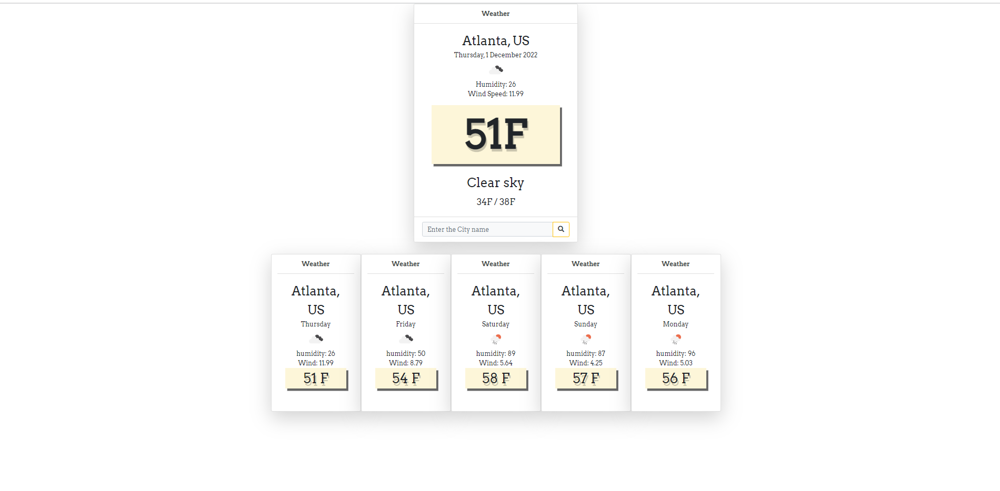
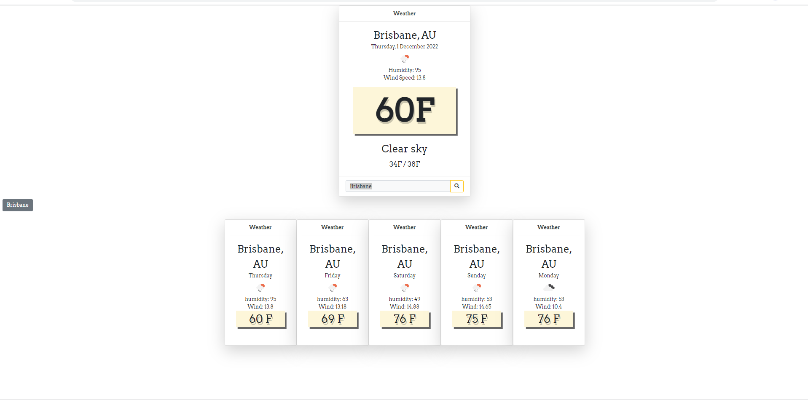
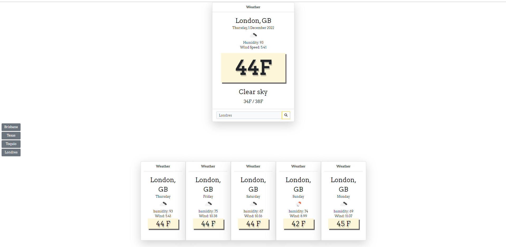

# Weather-Dashboard
- repository
https://github.com/silviaolinger/Weather-Dashboard
- deployed application
https://silviaolinger.github.io/Weather-Dashboard/

## Description
A simple weather application iwhich includes a search option, a list of cities, and a five-day forecast using API to  this display data.
## User Story
- AS A traveler
- I WANT to see the weather outlook for multiple cities
- SO THAT I can plan a trip accordingly
## Acceptance Criteria
- GIVEN a weather dashboard with form inputs
- WHEN I search for a city
- THEN I am presented with current and future conditions for that - - city and that city is added to the search history
- WHEN I view current weather conditions for that city
- THEN I am presented with the city name, the date, an icon representation of weather conditions, the temperature, the humidity, and the wind speed
- WHEN I view future weather conditions for that city
- THEN I am presented with a 5-day forecast that displays the date, an icon representation of weather conditions, the temperature, the wind speed, and the humidity
- WHEN I click on a city in the search history
- THEN I am again presented with current and future conditions for that city
## Usage
In this section a screenshoots of the application is available.
When the app is load the atlanta city current weather is displayed with the 5 days weather ahaed.
When searching for other cities, the current wheather and future conditions are displayed.

## Display Screen
***Default page***

***Searched Locations***

